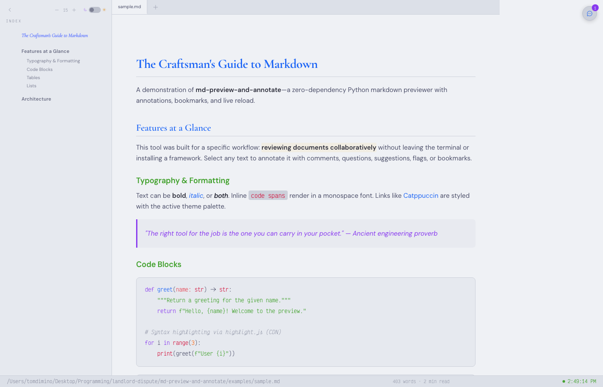
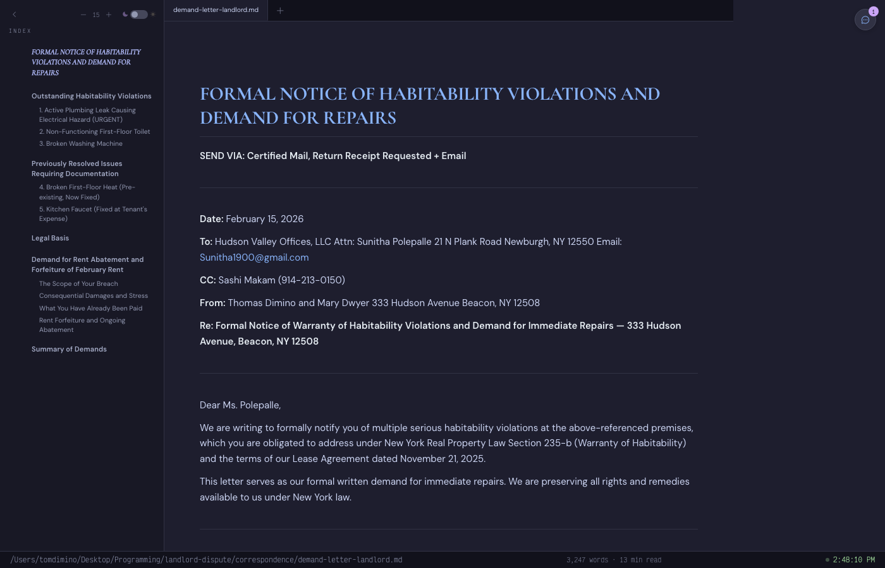
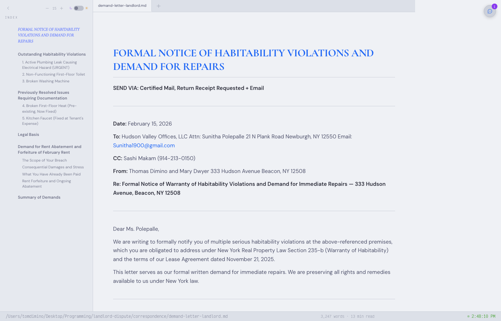

<p align="center">
  
</p>

# md-preview-and-annotate

Zero-dependency Python markdown previewer with annotations, bookmarks, and live reload.


## Features

- **Live-reload preview** — 500ms polling detects file changes automatically
- **Multi-tab support** — open multiple `.md` files; cross-file linking via `--add`
- **Tab reuse** — launching a new file while the server is running adds it as a tab instead of restarting
- **5 annotation types** — Comment, Question, Suggestion, Important, Bookmark
- **Selection-based carousel** — select any text, pick an annotation type from the floating UI
- **Threaded replies** — reply to any annotation inline
- **Resolve/archive workflow** — resolved annotations move to a separate archive file
- **Global bookmark index** — bookmarks persist to `~/.claude/bookmarks/` with an `INDEX.md` and per-snippet files
- **Auto-cleanup of orphaned annotations** — when anchor text is deleted, its annotations are removed on next load
- **Catppuccin dark/light themes** — Mocha (dark) and Latte (light), toggled in the status bar
- **Resizable TOC sidebar** — drag the right edge to adjust width (persisted across sessions)
- **Adjustable font size** — persisted in `localStorage`
- **Cross-file links** — clicking a `.md` link in content opens the target as a new tab
- **Smart text anchoring** — selections can span bold, italic, and code nodes
- **CLI annotation** — write annotations directly from the command line without a browser
- **Chrome `--app` mode** — opens in a frameless window (falls back to default browser)
- **Command palette** — `Cmd+K` / `Ctrl+K` for quick access to commands, tabs, and recent files
- **File tagging** — tag files with predefined (`draft`, `reviewed`, `final`, `important`, `archived`, `research`, `personal`) or custom tags; tags persist in sidecar JSON alongside annotations and display as colored pills in the palette header, status bar, and tab bar
- **Finder integration (macOS)** — `.app` bundle registers as `.md` handler for Open With

## Quick Start

```bash
python3 -m md_preview_and_annotate document.md
```

Opens in Chrome `--app` mode (falls back to default browser). No install, no build step, no dependencies.

```bash
# Multiple files
python3 -m md_preview_and_annotate file1.md file2.md

# Tab reuse — if the server is already running, new files open as tabs automatically
python3 -m md_preview_and_annotate another-file.md

# Custom port and author
python3 -m md_preview_and_annotate document.md --port 8080 --author "Alice"

# Explicit add to a running server (legacy)
python3 -m md_preview_and_annotate --add another-file.md

# Annotate from CLI (no browser needed)
python3 -m md_preview_and_annotate --annotate document.md \
  --text "some passage" --comment "This needs revision" --type suggestion
```

## Screenshots

### Annotation Panel


*Select any text, leave a note. The NOTES panel shows all annotations for the current document—each one anchored to a specific passage with author, timestamp, and type badge.*

### Dark Theme (Catppuccin Mocha)


*TOC sidebar auto-generated from headings. Annotated passages glow with highlight markers. Status bar shows file path, word count, and read time.*

### Light Theme (Catppuccin Latte)



*Toggle between Mocha and Latte with one click. All annotations, highlights, and layout carry over seamlessly.*

### Real-World: Demand Letter in Dark



*A habitability demand letter drafted and annotated in a Claude Code session. This is the workflow the tool was built for—reviewing real documents with AI, not toy demos.*

### Real-World: Demand Letter in Light



*The same 15-page letter in Catppuccin Latte. Full TOC navigation, every section and subsection linked.*

## How It's Different

| Feature | md-preview-and-annotate | markdown-annotations-svelte | md-review | Specmark |
|---------|------------------------|---------------------------|-----------|----------|
| Dependencies | **0** (Python stdlib) | Svelte + npm ecosystem | Node.js + npm | Web service |
| Annotation types | 5 (comment, question, suggestion, flag, bookmark) | Comments only | Inline comments | AI feedback |
| Themes | Catppuccin Mocha + Latte | Basic | Terminal | Web UI |
| Live reload | Yes (500ms) | No | No | N/A |
| Multi-tab | Yes | No | Yes | No |
| Threaded replies | Yes | No | No | No |
| Bookmark persistence | Global index | No | No | No |
| Tab reuse | Yes (automatic) | No | No | No |
| Cross-file links | Yes | No | No | No |
| Orphan auto-cleanup | Yes | No | No | No |
| Last updated | 2026 | 2020 (abandoned) | 2026 | 2026 |

### Why this exists

Most markdown annotation tools either require a heavy framework (Svelte, React, Electron) or operate only in the terminal. This tool is:

- **Zero-dependency** — pure Python stdlib server. No npm, no pip install, no build step.
- **Modular** — 6 Python files + 2 static files. Drop it into any project.
- **AI-native** — built for Claude Code workflows. Annotate from CLI, bookmark to `~/.claude/`.
- **Beautiful** — Catppuccin theming with Cormorant Garamond, DM Sans, and Victor Mono typography.

The three CDN scripts (marked.js, highlight.js, Phosphor Icons) load on first page view and are cached by the browser. After that, the tool works fully offline.

## CLI Reference

```
python3 -m md_preview_and_annotate <file.md> [file2.md ...] [OPTIONS]

Options:
  --port PORT       Server port (default: 3031)
  --author NAME     Default annotation author name (default: "Tom")
  --add FILE        Add a file to a running server instance
  --annotate FILE   Write an annotation directly to sidecar JSON (no server)
    --text TEXT       Anchor text to annotate
    --comment TEXT    Annotation body
    --type TYPE       comment | question | suggestion | important | bookmark
    --author NAME     Author name (default: "Claude")
```

## Annotation Schema

Annotations are stored in sidecar JSON files (`file.md.annotations.json`) alongside each document. The original markdown is never modified.

```json
{
  "version": 1,
  "tags": ["draft", "research"],
  "annotations": [
    {
      "id": "a1b2c3",
      "anchor": { "text": "selected passage", "heading": "Section Title", "offset": 0 },
      "author": { "name": "Tom", "type": "human" },
      "created": "2026-02-15T12:00:00+00:00",
      "body": "This needs revision.",
      "type": "comment",
      "resolved": false,
      "replies": []
    }
  ]
}
```

Resolved annotations are archived to `file.md.annotations.resolved.json`.

## Command Palette

Press `Cmd+K` (Mac) or `Ctrl+K` to open the command palette. Available commands:

- **File** — open a `.md`, `.markdown`, or `.txt` file via native picker
- **Recent Files** — reopen the last 5 files you viewed
- **Switch to [tab]** — quick-switch between open tabs
- **Close Current Tab** — close the active tab
- **Add Tag...** — enter tag mode to add or create tags
- **Toggle Theme** — switch between Mocha and Latte
- **Toggle Sidebar** — show/hide the TOC
- **Increase/Decrease Font** — adjust font size
- **Toggle Annotations** — open/close the notes panel

The palette header displays file metadata for the active tab: filename, path, word count, estimated read time, annotation count, and any tags as colored pills.

### Tag Mode

Type `#` in the palette search field (or select "Add Tag...") to enter tag mode. Seven predefined tags are offered with color-coded suggestions: `draft`, `reviewed`, `final`, `important`, `archived`, `research`, `personal`. Type any other name and press Enter to create a custom tag. Tags appear as colored pills in the palette header, in the status bar, and as dots on the tab bar.

A floating `⌘K` hint badge appears in the bottom-right corner until you've used the palette 3 times.

Third-party integrations can register custom commands:
```javascript
CommandPalette.register('My Tools', [
  { id: 'my-cmd', label: 'Do Something', icon: 'ph-star', action: () => doSomething() },
]);
```

## Finder Integration (macOS)

Register as a `.md` file handler so you can right-click → Open With → Markdown Preview.

```bash
cd macos && bash build.sh
```

This installs `Markdown Preview.app` to `~/Applications/` and registers with Launch Services.

```bash
# Open a file from Terminal
open -a "Markdown Preview" document.md

# Set as default .md handler (requires duti)
brew install duti
duti -s com.minoanmystery.md-preview .md all
```

## Architecture

```
md_preview_and_annotate/
├── __init__.py          # Package metadata
├── __main__.py          # CLI entry point (serve, add, annotate)
├── server.py            # HTTP server + REST API (13 endpoints)
├── template.py          # HTML shell assembly (inlines JS + CSS)
├── annotations.py       # Sidecar JSON I/O + orphan cleanup + tag persistence
├── bookmarks.py         # Global ~/.claude/bookmarks/ persistence
└── static/
    ├── app.js           # Client-side rendering, carousel, gutter (~1190 lines)
    ├── palette.js       # Command palette + tag mode (Cmd+K) (~650 lines)
    └── styles.css       # Catppuccin Mocha + Latte (~1465 lines)
```

**Data flow:** `__main__.py` → `server.py` → `template.py` assembles the HTML shell → `static/app.js` renders markdown via marked.js → annotations round-trip through `server.py` ↔ `annotations.py` sidecar JSON. Bookmarks additionally persist via `bookmarks.py` → `~/.claude/bookmarks/`.

## Global Claude.md Integration

This tool was designed to work within a broader Claude Code ecosystem. For details on how `~/.claude/`, `CLAUDE.md`, `soul.md`, and the global bookmarks directory fit together, see [**The ~/.claude/ Ecosystem**](CLAUDE-CODE-ECOSYSTEM.md).

## License

MIT
