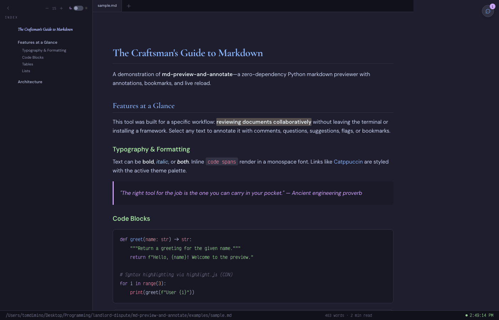
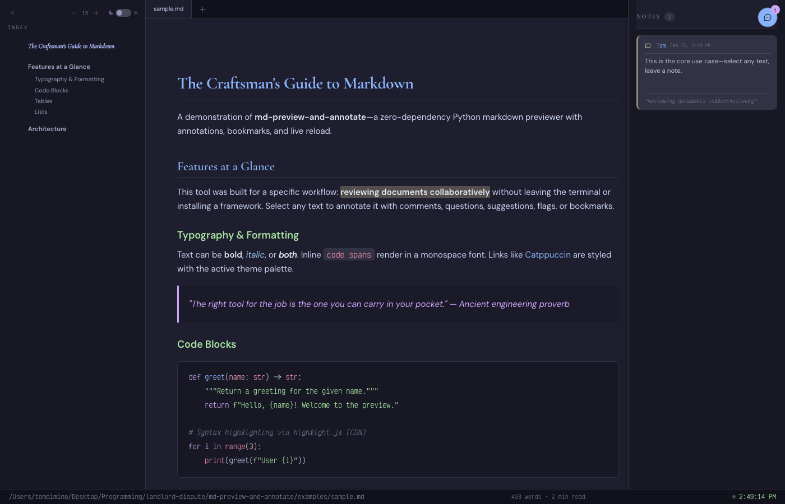

<p align="center">
  
</p>

# Dabarat

AI-native markdown previewer with annotations, bookmarks, and live reload. Zero dependencies.



## Features

- **Live-reload preview** — 500ms polling detects file changes automatically
- **Multi-tab support** — open multiple `.md` files; cross-file linking via `--add`
- **Tab reuse** — launching a new file while the server is running adds it as a tab instead of restarting
- **5 annotation types** — Comment, Question, Suggestion, Important, Bookmark
- **Selection-based carousel** — select any text, pick an annotation type from the floating UI
- **Threaded replies** — reply to any annotation inline
- **Resolve/archive workflow** — resolved annotations move to a separate archive file
- **Global bookmark index** — bookmarks persist to `~/.claude/bookmarks/` with an `INDEX.md` and per-snippet files
- **Auto-cleanup of orphaned annotations** — when anchor text is deleted, its annotations are removed on next load
- **6 Catppuccin themes** — 3 dark (Mocha, Rosé Pine, Tokyo Storm) + 3 light (Latte, Rosé Pine Dawn, Tokyo Light), toggled in the status bar or settings panel
- **Resizable TOC sidebar** — drag the right edge to adjust width (persisted across sessions)
- **Adjustable font size** — persisted in `localStorage`
- **Switchable emoji styles** — Twitter (Twemoji), OpenMoji, Google Noto Color Emoji, or native OS emoji; selectable via command palette Settings or `Cmd+K` → Cycle Emoji Style
- **Cross-file links** — clicking a `.md` link in content opens the target as a new tab
- **Smart text anchoring** — selections can span bold, italic, and code nodes
- **CLI annotation** — write annotations directly from the command line without a browser
- **Chrome `--app` mode** — opens in a frameless window (falls back to default browser)
- **Command palette** — `Cmd+K` / `Ctrl+K` for quick access to commands, tabs, and recent files
- **File tagging** — tag files with predefined (`draft`, `reviewed`, `final`, `important`, `archived`, `research`, `personal`) or custom tags; tags persist in sidecar JSON alongside annotations and display as colored pills in the palette header, status bar, and tab bar
- **Prompt engineering support** — `.prompt.md` files with YAML frontmatter render a clickable metadata indicator bar showing name, version, type, and variable count; clicking opens a full metadata popup with model, temperature, labels, tags, and a variables table with types, defaults, and descriptions
- **Template variable highlighting** — `{{variable}}` (Mustache) and `${variable}` (shell) template slots are highlighted as colored pills in the preview; pills include CSS-only tooltips showing variable schema from frontmatter
- **Prompt-specific tags** — 6 additional tags for prompt workflows: `prompt:system`, `prompt:user`, `prompt:assistant`, `prompt:chain`, `prompt:cognitive`, `prompt:tested`
- **Inline editing** — `Cmd+E` to edit raw markdown with a change-tracking gutter (green/yellow/red diff markers), auto-save with atomic writes
- **Side-by-side diff** — compare any two markdown files with word-level granularity, synchronized scroll, resizable split
- **Version history** — git-backed timeline panel with diff stats, compare any version against current, one-click restore
- **Workspace system** — VS Code-style `.dabarat-workspace` files with multi-root folders and pinned files; collapsible sidebar sections, merged card grid, macOS native dialogs for folder/file picking, recent workspaces tracking
- **Workspace home page** — TOC sidebar transforms into a directory browser; selecting a folder populates the main area with file cards showing word counts, annotation counts, version counts, smart badges, and markdown previews
- **Smart file-type badges** — 10 pattern matchers detect prompt, agent config, plan, spec, readme, architecture, changelog, todo, license, and research files
- **Empty state quotes** — 30 curated quotes from scholarly and classical sources cycle every 5 minutes with crossfade transitions
- **Image lightbox** — click any content image to open a sleek overlay with blur backdrop, keyboard navigation (arrows, Escape), and zoom
- **Image effects** — content images get subtle border, layered shadows, hover lift + glow, zoom cursor; theme-aware Latte overrides
- **Motion One animations** — staggered card entrance, sidebar cascade, card removal animation, view toggle crossfade; progressive enhancement with `if (window.Motion)` guards
- **Finder integration (macOS)** — `.app` bundle registers as `.md` handler for Open With

## Quick Start

```bash
python3 -m md_preview_and_annotate document.md
```

Opens in Chrome `--app` mode (falls back to default browser). No install, no build step, no dependencies.

```bash
# Multiple files
python3 -m md_preview_and_annotate file1.md file2.md

# Tab reuse — if the server is already running, new files open as tabs automatically
python3 -m md_preview_and_annotate another-file.md

# Open a workspace (multi-root folders + pinned files)
python3 -m md_preview_and_annotate --workspace research.dabarat-workspace

# Custom port and author
python3 -m md_preview_and_annotate document.md --port 8080 --author "Alice"

# Explicit add to a running server (legacy)
python3 -m md_preview_and_annotate --add another-file.md

# Annotate from CLI (no browser needed)
python3 -m md_preview_and_annotate --annotate document.md \
  --text "some passage" --comment "This needs revision" --type suggestion
```

## Screenshots

### Annotation Panel



*Catppuccin Latte with background image, TOC sidebar, and annotation panel. Select any text to leave a note—each annotation is anchored to a specific passage with author, timestamp, and type badge.*

### Light Theme — Workspace with Smart Badges


*Workspace home in Catppuccin Latte. Recent Files view with smart badges (plan, readme, changelog, agent config), markdown previews, word counts, and directory browser sidebar.*

### Workspace Home with Quotes


*Empty workspace home with curated quotes cycling every 5 minutes. Background image visible through semi-transparent surfaces. Directory browser in the sidebar.*

## How It's Different

| Feature | Dabarat | markdown-annotations-svelte | md-review | Specmark |
|---------|---------|---------------------------|-----------|----------|
| Dependencies | **0** (Python stdlib) | Svelte + npm ecosystem | Node.js + npm | Web service |
| Annotation types | 5 (comment, question, suggestion, flag, bookmark) | Comments only | Inline comments | AI feedback |
| Themes | 6 Catppuccin (3 dark + 3 light) | Basic | Terminal | Web UI |
| Live reload | Yes (500ms) | No | No | N/A |
| Multi-tab | Yes | No | Yes | No |
| Threaded replies | Yes | No | No | No |
| Bookmark persistence | Global index | No | No | No |
| Tab reuse | Yes (automatic) | No | No | No |
| Multi-root workspaces | Yes (.dabarat-workspace) | No | No | No |
| Cross-file links | Yes | No | No | No |
| Orphan auto-cleanup | Yes | No | No | No |
| Last updated | 2026 | 2020 (abandoned) | 2026 | 2026 |

### Why this exists

Most markdown annotation tools either require a heavy framework (Svelte, React, Electron) or operate only in the terminal. This tool is:

- **Zero-dependency** — pure Python stdlib server. No npm, no pip install, no build step.
- **Modular** — 11 Python modules + 16 JS modules + 14 CSS modules, concatenated at serve time into a single HTML document.
- **AI-native** — built for Claude Code workflows. Annotate from CLI, bookmark to `~/.claude/`.
- **Beautiful** — Catppuccin theming with Cormorant Garamond, DM Sans, and Victor Mono typography. Motion One animations for staggered card entrance, sidebar cascade, and view transitions.

Six CDN scripts (marked.js, highlight.js, Phosphor Icons, Twemoji, Vibrant.js, Motion One) load on first page view and are cached by the browser. Motion One is optional—all animations fall back to CSS `@keyframes` if the CDN is unavailable. After first load, the tool works fully offline.

## CLI Reference

```
python3 -m md_preview_and_annotate <file.md> [file2.md ...] [OPTIONS]
python3 -m md_preview_and_annotate --workspace <path.dabarat-workspace> [OPTIONS]

Options:
  --port PORT            Server port (default: 3031)
  --author NAME          Default annotation author name (default: "Tom")
  --workspace FILE       Open a .dabarat-workspace file (multi-root folders + pinned files)
  --max-instances N      Limit concurrent server instances (default: 5)
  --add FILE             Add a file to a running server instance
  --annotate FILE        Write an annotation directly to sidecar JSON (no server)
    --text TEXT            Anchor text to annotate
    --comment TEXT          Annotation body
    --type TYPE            comment | question | suggestion | important | bookmark
    --author NAME          Author name (default: "Claude")
```

## Annotation Schema

Annotations are stored in sidecar JSON files (`file.md.annotations.json`) alongside each document. The original markdown is never modified.

```json
{
  "version": 1,
  "tags": ["draft", "research"],
  "annotations": [
    {
      "id": "a1b2c3",
      "anchor": { "text": "selected passage", "heading": "Section Title", "offset": 0 },
      "author": { "name": "Tom", "type": "human" },
      "created": "2026-02-15T12:00:00+00:00",
      "body": "This needs revision.",
      "type": "comment",
      "resolved": false,
      "replies": []
    }
  ]
}
```

Resolved annotations are archived to `file.md.annotations.resolved.json`.

## Command Palette

Press `Cmd+K` (Mac) or `Ctrl+K` to open the command palette. Available commands:

- **File** — open a `.md`, `.markdown`, or `.txt` file via native picker
- **Recent Files** — reopen the last 5 files you viewed
- **Switch to [tab]** — quick-switch between open tabs
- **Close Current Tab** — close the active tab
- **Add Tag...** — enter tag mode to add or create tags
- **Toggle Theme** — switch between Mocha and Latte
- **Toggle Sidebar** — show/hide the TOC
- **Increase/Decrease Font** — adjust font size
- **Toggle Annotations** — open/close the notes panel
- **Cycle Emoji Style** — cycle through Twitter → OpenMoji → Noto → Native
- **Settings** — full settings panel with theme, font sizes, opacity, emoji style, TOC width, and author
- **New Workspace...** — save dialog to create a `.dabarat-workspace` file
- **Open Workspace...** — file picker for `.dabarat-workspace` files
- **Add Folder to Workspace** — folder picker (visible when workspace is active)
- **Add File to Workspace** — file picker (visible when workspace is active)
- **Close Workspace** — deactivate current workspace (visible when workspace is active)

The palette header displays file metadata for the active tab: filename, path, word count, estimated read time, annotation count, and any tags as colored pills.

### Tag Mode

Type `#` in the palette search field (or select "Add Tag...") to enter tag mode. Seven predefined tags are offered with color-coded suggestions: `draft`, `reviewed`, `final`, `important`, `archived`, `research`, `personal`. Type any other name and press Enter to create a custom tag. Tags appear as colored pills in the palette header, in the status bar, and as dots on the tab bar.

A floating `⌘K` hint badge appears in the bottom-right corner until you've used the palette 3 times.

Third-party integrations can register custom commands:
```javascript
CommandPalette.register('My Tools', [
  { id: 'my-cmd', label: 'Do Something', icon: 'ph-star', action: () => doSomething() },
]);
```

## Workspaces

Workspaces group multiple folders and individual files into a single view, like VS Code's multi-root workspaces.

### `.dabarat-workspace` Schema

```json
{
  "version": "1.0",
  "name": "My Research",
  "folders": [
    { "path": "/Users/tom/Desktop/sources", "name": "Sources" },
    { "path": "/Users/tom/.claude/plans", "name": "Plans" }
  ],
  "files": [
    { "path": "/Users/tom/Desktop/README.md" },
    { "path": "/Users/tom/.claude/CLAUDE.md" }
  ]
}
```

The file is readable JSON you can commit to git or share.

### Creating a Workspace

- **From CLI**: `dabarat --workspace research.dabarat-workspace`
- **From palette**: `Cmd+K` → "New Workspace..." — opens a save dialog, creates the file, and activates it
- **From sidebar**: click `[+]` → "New Workspace..." when on the home screen

### Managing Folders and Files

Once a workspace is active, the sidebar shows collapsible folder sections. Use the `[+]` button to add folders or pin individual files. Remove entries with the `[x]` button on any section header or file entry. All changes write back to the `.dabarat-workspace` file immediately.

### Recent Workspaces

Previously opened workspaces appear as cards on the home screen (max 10 tracked). Click any card to reopen that workspace.

## Finder Integration (macOS)

Register as a `.md` file handler so you can right-click → Open With → Markdown Preview.

```bash
cd macos && bash build.sh
```

This installs `Markdown Preview.app` to `~/Applications/` and registers with Launch Services.

```bash
# Open a file from Terminal
open -a "Markdown Preview" document.md

# Set as default .md handler (requires duti)
brew install duti
duti -s com.minoanmystery.md-preview .md all
```

## Architecture

```
md_preview_and_annotate/
├── __init__.py          # Package metadata
├── __main__.py          # CLI entry point (serve, add, annotate)
├── server.py            # HTTP server + 35 REST API endpoints
├── template.py          # HTML shell assembly (concatenates 16 JS + 14 CSS modules)
├── annotations.py       # Sidecar JSON I/O + orphan cleanup + tag persistence
├── bookmarks.py         # Global ~/.claude/bookmarks/ persistence
├── frontmatter.py       # YAML frontmatter parser (stdlib, pyyaml fallback) + mtime cache
├── diff.py              # Side-by-side markdown diff engine (SequenceMatcher)
├── history.py           # Git-backed version history (~/.dabarat/history/)
├── recent.py            # Recently opened files + metadata extraction
├── workspace.py         # .dabarat-workspace CRUD + recent workspaces
└── static/
    ├── js/              # 16 modules concatenated in dependency order
    │   ├── state.js     # Global state, config
    │   ├── utils.js     # Shared utilities
    │   ├── theme.js     # Theme, font, emoji, TOC resize
    │   ├── render.js    # Markdown rendering pipeline
    │   ├── ...          # frontmatter, variables, tags, tabs, annotations, diff, editor
    │   ├── lightbox.js  # Image lightbox (zoom, keyboard nav, blur backdrop)
    │   ├── home.js      # Workspace-driven home page + directory browser
    │   ├── polling.js   # 500ms content poll loop
    │   └── init.js      # Bootstrap
    ├── css/             # 14 modules concatenated in dependency order
    │   ├── theme-variables.css  # Catppuccin Mocha + Latte tokens
    │   └── ...          # layout, typography, annotations, responsive, palette, etc.
    └── palette.js       # Command palette + tag mode (Cmd+K) — loaded separately
```

**Data flow:** `__main__.py` → `server.py` → `template.py` assembles a single HTML document (all JS/CSS inlined) → client renders markdown via marked.js → annotations round-trip through `server.py` ↔ `annotations.py` sidecar JSON. Bookmarks persist via `bookmarks.py` → `~/.claude/bookmarks/`. For `.prompt.md` files, `frontmatter.py` parses YAML frontmatter and returns it alongside content via `/api/content`. Edit mode saves via `/api/save` (atomic write + auto-commit to `history.py`). Home page workspace browser uses `/api/browse-dir` for enriched directory metadata.

## Origins

Where the name comes from: the Semitic root D-B-R, Plassmann's four-stage model, and the Lady of the Labyrinth. See [**docs/backstory.md**](docs/backstory.md).

## Global Claude.md Integration

This tool was designed to work within a broader Claude Code ecosystem. For details on how `~/.claude/`, `CLAUDE.md`, `soul.md`, and the global bookmarks directory fit together, see [**The ~/.claude/ Ecosystem**](claude-code-ecosystem.md).

## Companion Projects

Dabarat is part of the [Claudius](https://github.com/tdimino/claudius) ecosystem:

| Project | Description |
|---------|-------------|
| [claude-code-minoan](https://github.com/tdimino/claude-code-minoan) | Skill/agent/hook framework for Claude Code |
| [claudicle](https://github.com/tdimino/claudicle) | 4-layer soul agent framework for AI personalities |

## License

MIT
