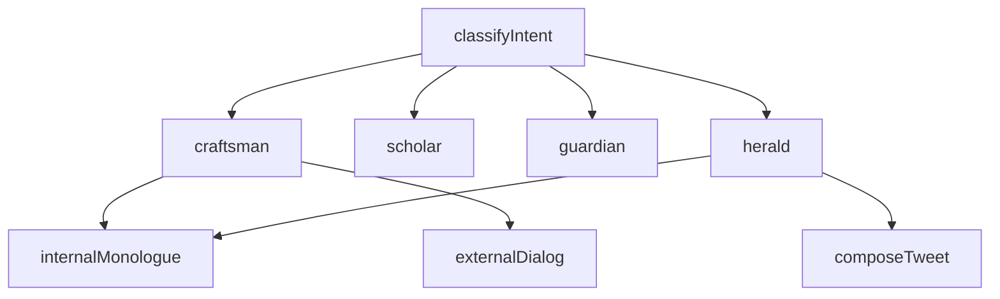

# Plan: Prompt Engineering Modules for md-preview-and-annotate

**Date**: 2026-02-17
**Deepened**: 2026-02-17
**Repo**: `/Users/tomdimino/Desktop/Programming/md-preview-and-annotate/`

## Enhancement Summary

**Research agents used**: 4 (YAML frontmatter parsing, variable highlighting, diff engine, Mermaid flow visualizer)

### Key Improvements
1. Complete stdlib YAML parser implementation with BOM/CRLF normalization, literal block scalars, list-of-dicts — no pyyaml dependency needed
2. Variable highlighting via DOM TreeWalker with CSS-only tooltips, explicit ordering (variables BEFORE annotations to avoid DOM conflicts)
3. Word-level diff using `difflib.SequenceMatcher` with frontmatter-aware splitting and collapsible sections
4. Mermaid lazy-loading from CDN v11.4.1 with Catppuccin theming via `themeVariables`, cycle detection, click-to-open interaction

### New Considerations Discovered
- marked.js escapes `{{` to `&lbrace;&lbrace;` in some contexts — regex must match both raw and HTML-entity forms
- `autojunk=False` required in SequenceMatcher for short prompt sequences (default heuristic skips common tokens)
- Mermaid `securityLevel: 'loose'` required for click callbacks but safe since we control all input
- Variable highlighting must run BEFORE annotation highlights to avoid corrupting annotation text ranges

---

## Context

md-preview-and-annotate is a zero-dependency Python markdown previewer with annotations, bookmarks, tags, and a command palette. We want to extend it with lightweight modules that make it a first-class prompt engineering environment — for authoring system prompts, building multi-step cognitive flows (like QAKat, Aldea Soul Engine cognitive steps), and versioning prompt iterations.

**Inputs**: Aldea prompt development patterns (QAKat's `${variable}` slots, 3-message conversation structure, persona/worldview/voice framework, practitioner-specific variants), Kothar cognitive step architecture (factory pattern, soul.md identity files, mental process routing), and industry tools (Langfuse label-based versioning, Braintrust content-addressed versions, Mustache `{{variable}}` consensus, DSPy signatures, MLflow prompt registry).

**Design principle**: Each module is a self-contained addition — new Python file + JS/CSS extensions + endpoint(s). No rewrites of existing code. All modules are opt-in: they activate when they detect `.prompt.md` files or YAML frontmatter with prompt-specific fields.

---

## Module 1: `.prompt.md` File Format Convention

**What**: Define a file format that md-preview-and-annotate auto-detects and renders with prompt-specific features. Standard markdown with YAML frontmatter.

**Format**:
```yaml
---
name: qakat-dr-shefali
slug: qakat-dr-shefali
version: 3
type: chat                    # chat | text | chain
model: claude-sonnet-4-5-20250929
temperature: 0.7
labels: [production]
author: tom
created: 2026-02-17
variables:
  - name: practitionerName
    type: string
    required: true
  - name: content
    type: string
    description: Practitioner's written content to review
    required: true
  - name: qaPairsCount
    type: integer
    default: 10
  - name: trainingPrompt
    type: string
    description: Brief system identity statement
tags: [qakat, dr-shefali, synthetic-data]
depends_on: []               # For chain steps
---

## Embodiment Framework

You are {{practitionerName}}. You are reviewing your own written content...
```

**Files**: No code — just documentation in `agent_docs/prompt-format.md`. The format drives all other modules.

---

## Module 2: Frontmatter Parser + Metadata Card

**What**: Parse YAML frontmatter from `.prompt.md` files and render a styled metadata card above the content, similar to how GitHub renders repo metadata.

**Implementation**:
- `md_preview_and_annotate/frontmatter.py` (~60 lines) — parse YAML frontmatter using `yaml` stdlib or regex extraction (stdlib-only constraint means we parse manually or add `pyyaml` as optional)
- Extend `server.py`: new field `frontmatter` returned alongside `content` in `/api/content` response
- Extend `app.js`: `renderFrontmatterCard()` builds a styled card from frontmatter JSON
- CSS: `.prompt-meta-card` with Catppuccin-themed badges for model, temperature, version, labels

**Card shows**:
```
┌──────────────────────────────────────────────────┐
│ qakat-dr-shefali  v3  chat                       │
│ claude-sonnet-4-5  temp 0.7  ● production        │
│ 4 variables  tom  2026-02-17                     │
│ #qakat  #dr-shefali  #synthetic-data             │
└──────────────────────────────────────────────────┘
```

**Stdlib YAML parsing**: Since we can't add pip dependencies, we parse YAML frontmatter with a minimal regex + `json`-style parser that handles the flat/simple YAML we need (strings, numbers, lists). Complex YAML → recommend `pyyaml`.

**Files to create/modify**:
- **Create**: `md_preview_and_annotate/frontmatter.py` (~150 lines)
- **Modify**: `server.py` — add frontmatter to `/api/content` response
- **Modify**: `app.js` — add `renderFrontmatterCard()` after `render()`
- **Modify**: `styles.css` — add `.prompt-meta-card` styles

### Research Insights (Frontmatter Parser)

**Extraction regex**:
```python
import re
FM_RE = re.compile(r'\A\xef\xbb\xbf?---[ \t]*\r?\n(.*?\r?\n)---[ \t]*\r?\n', re.DOTALL)
```
Handles UTF-8 BOM and CRLF. Group 1 is the raw YAML block; everything after the closing `---\n` is the body.

**Stdlib parser approach** — `parse_yaml_subset()`:
```python
def parse_yaml_subset(raw: str) -> dict:
    """Parse flat YAML with strings, numbers, bools, inline lists, block lists, list-of-dicts."""
    result = {}
    lines = raw.splitlines()
    i = 0
    while i < len(lines):
        line = lines[i]
        if not line.strip() or line.strip().startswith('#'):
            i += 1; continue
        m = re.match(r'^(\w[\w\s]*?):\s*(.*)', line)
        if not m:
            i += 1; continue
        key, val = m.group(1).strip(), m.group(2).strip()
        if val.startswith('[') and val.endswith(']'):
            # Inline list: [a, b, c]
            result[key] = [v.strip().strip('"\'') for v in val[1:-1].split(',') if v.strip()]
        elif val == '' or val == '|':
            # Block list or literal block scalar
            items = []
            i += 1
            while i < len(lines) and lines[i].startswith('  '):
                sub = lines[i].strip()
                if sub.startswith('- '):
                    item_val = sub[2:].strip()
                    if ':' in item_val:
                        # list-of-dicts: parse nested key/value pairs
                        d = _parse_inline_dict(item_val)
                        i += 1
                        while i < len(lines) and re.match(r'^    \w', lines[i]):
                            k2, v2 = lines[i].strip().split(':', 1)
                            d[k2.strip()] = _coerce(v2.strip())
                            i += 1
                        items.append(d)
                        continue
                    items.append(_coerce(item_val))
                else:
                    items.append(sub)
                i += 1
            result[key] = items if items else val
            continue
        else:
            result[key] = _coerce(val)
        i += 1
    return result

def _coerce(val: str):
    """Coerce string to int/float/bool/None or return stripped string."""
    if val.lower() in ('true', 'yes'): return True
    if val.lower() in ('false', 'no'): return False
    if val.lower() in ('null', '~', ''): return None
    for typ in (int, float):
        try: return typ(val)
        except ValueError: pass
    return val.strip('"\'')
```

**Caching strategy**: Cache parsed frontmatter keyed on `(file_path, mtime)` so re-renders during polling don't re-parse:
```python
_fm_cache: dict[tuple[str, float], dict] = {}

def get_frontmatter(path: str) -> tuple[dict, str]:
    mtime = os.path.getmtime(path)
    key = (path, mtime)
    if key in _fm_cache:
        return _fm_cache[key]
    raw = open(path).read()
    m = FM_RE.match(raw)
    if not m:
        return {}, raw
    fm = parse_yaml_subset(m.group(1))
    body = raw[m.end():]
    _fm_cache[key] = (fm, body)
    return fm, body
```

**Optional pyyaml fallback**: Try `import yaml` first, fall back to `parse_yaml_subset`:
```python
try:
    import yaml
    def _parse(raw): return yaml.safe_load(raw) or {}
except ImportError:
    _parse = parse_yaml_subset
```

**Edge cases**:
- Files with `---` that aren't YAML (e.g., markdown horizontal rules) — the `\A` anchor prevents false matches mid-file
- Multiline string values (description fields) — literal block scalar `|` support covers this
- Duplicate keys — last value wins (Python dict behavior)
- Empty frontmatter `---\n---\n` — returns `{}`

---

## Module 3: Variable Highlighting

**What**: Visually distinguish `{{variable}}` and `${variable}` template slots in the preview with colored inline badges, similar to how annotations highlight text.

**Implementation**:
- Extend `app.js`: `applyVariableHighlights()` runs after `render()`, regex-matches `{{...}}` and `${...}` in rendered HTML text nodes
- Wraps matches in `<span class="prompt-variable" data-var="variableName">{{variableName}}</span>`
- Tooltip shows variable schema (type, default, description) from frontmatter if available
- CSS: pill-styled with Catppuccin mauve/teal, distinct from annotation highlights

**Detection**: Only activates when frontmatter contains `variables:` field OR file extension is `.prompt.md`.

**Files to modify**:
- **Modify**: `app.js` — add `applyVariableHighlights()` (~80 lines)
- **Modify**: `styles.css` — add `.prompt-variable` styles (~30 lines)

### Research Insights (Variable Highlighting)

**Critical ordering**: Variable highlighting MUST run BEFORE `applyHighlights()` (annotation highlights). Annotation highlights use `findTextRange()` which records character offsets — if variable pill `<span>` nodes are inserted after annotations, the offsets break. Pipeline:
```
render() → renderFrontmatterCard() → applyVariableHighlights() → applyHighlights()
```

**DOM TreeWalker pattern** (avoids innerHTML pitfalls):
```javascript
function applyVariableHighlights(frontmatter) {
    const content = document.getElementById('content');
    const varRegex = /(\{\{([a-zA-Z_][\w.]*?)\}\})|(\$\{([a-zA-Z_][\w.]*?)\})/g;
    // Also match HTML-entity escaped forms from marked.js
    const entityRegex = /(&lbrace;&lbrace;([a-zA-Z_][\w.]*?)&rbrace;&rbrace;)/g;

    const walker = document.createTreeWalker(content, NodeFilter.SHOW_TEXT, {
        acceptNode(node) {
            // Skip <pre>, <code>, already-highlighted nodes
            if (node.parentElement.closest('pre, code, .tpl-var-pill')) {
                return NodeFilter.FILTER_REJECT;
            }
            return NodeFilter.FILTER_ACCEPT;
        }
    });

    const matches = [];
    let node;
    while (node = walker.nextNode()) {
        const text = node.textContent;
        let m;
        varRegex.lastIndex = 0;
        while ((m = varRegex.exec(text)) !== null) {
            matches.push({ node, match: m[0], name: m[2] || m[4], index: m.index });
        }
    }

    // Process in reverse order to preserve indices
    for (let i = matches.length - 1; i >= 0; i--) {
        const { node, match, name, index } = matches[i];
        const before = document.createTextNode(node.textContent.slice(0, index));
        const pill = document.createElement('span');
        pill.className = 'tpl-var-pill';
        pill.dataset.var = name;
        pill.textContent = match;

        // Tooltip from frontmatter schema
        const varDef = (frontmatter?.variables || []).find(v => v.name === name);
        if (varDef) {
            const parts = [];
            if (varDef.type) parts.push(varDef.type);
            if (varDef.default !== undefined) parts.push(`default: ${varDef.default}`);
            if (varDef.description) parts.push(varDef.description);
            pill.dataset.tooltip = parts.join(' · ');
        }

        const after = document.createTextNode(node.textContent.slice(index + match.length));
        node.parentNode.replaceChild(after, node);
        after.parentNode.insertBefore(pill, after);
        pill.parentNode.insertBefore(before, pill);
    }
}
```

**CSS-only tooltip** (no JS hover handlers):
```css
.tpl-var-pill {
    display: inline;
    padding: 1px 6px;
    border-radius: 4px;
    font-family: var(--font-mono, 'JetBrains Mono', monospace);
    font-size: 0.88em;
    background: rgba(203, 166, 247, 0.18);   /* --ctp-mauve */
    color: #cba6f7;
    border: 1px solid rgba(203, 166, 247, 0.30);
    cursor: default;
    position: relative;
}

/* ${var} uses teal to distinguish from {{var}} */
.tpl-var-pill[data-var]::before {
    content: '';
}

.tpl-var-pill[data-tooltip]:hover::after {
    content: attr(data-tooltip);
    position: absolute;
    bottom: calc(100% + 6px);
    left: 50%;
    transform: translateX(-50%);
    padding: 4px 10px;
    border-radius: 6px;
    font-size: 0.82em;
    white-space: nowrap;
    background: var(--ctp-surface0, #313244);
    color: var(--ctp-text, #cdd6f4);
    border: 1px solid var(--ctp-surface1, #45475a);
    z-index: 1000;
    pointer-events: none;
}

/* Light mode */
[data-theme="latte"] .tpl-var-pill {
    background: rgba(136, 57, 239, 0.12);
    color: #8839ef;
    border-color: rgba(136, 57, 239, 0.25);
}
```

**marked.js escaping caveat**: marked.js may escape `{{` as `&lbrace;&lbrace;` inside certain contexts. The regex should also scan for entity-escaped forms, or run highlighting on the raw markdown before `marked()` converts it. Safest approach: run on rendered HTML text nodes with the TreeWalker, which sees the decoded text.

**Edge cases**:
- Nested variables `{{foo.bar}}` — the `[\w.]*` pattern handles dot notation
- Adjacent variables `{{a}}{{b}}` — the reverse-order processing handles this
- Variables inside code blocks — the `closest('pre, code')` check excludes them
- Empty variables `{{}}` — the `[a-zA-Z_]` requirement at start rejects these

---

## Module 4: Variable Manifest Panel

**What**: A panel (reusing the annotations gutter pattern) that lists all variables found in the current prompt, with their schema from frontmatter. Optional fill-in mode for previewing rendered output.

**Implementation**:
- Extend `template.py`: add `<div id="variables-gutter">` alongside existing annotations gutter
- Extend `app.js`: `renderVariableManifest()` populates the panel from frontmatter `variables` array + any `{{...}}` found in content that aren't in the manifest (orphan detection — mirrors annotation orphan cleanup)
- **Fill-in mode**: Text inputs for each variable. "Preview" button sends values to new endpoint `/api/render-prompt` which does Mustache-style substitution server-side and returns rendered markdown. Preview renders in a temporary overlay.

**Files to create/modify**:
- **Modify**: `template.py` — add variables gutter HTML
- **Modify**: `app.js` — add `renderVariableManifest()` (~100 lines)
- **Modify**: `styles.css` — add `.var-gutter` styles
- **Modify**: `server.py` — add `POST /api/render-prompt` endpoint (~30 lines)

---

## Module 5: Version Diff View

**What**: Side-by-side or inline diff between prompt versions. Critical for iteration — see exactly what changed between v2 and v3 of a QAKat prompt.

**Implementation**:
- `md_preview_and_annotate/diff.py` (~80 lines) — uses `difflib.unified_diff` or `difflib.HtmlDiff` (both stdlib)
- New endpoint: `GET /api/diff?tab={id}&against={path}` — returns HTML diff
- Extend command palette: "Compare with..." command that opens a file picker, fetches diff, renders in content area
- Inline diff rendering: green/red line highlighting in content div, or split-pane if tab system supports it

**Versioning convention**: Prompt directories follow this structure:
```
prompts/qakat-dr-shefali/
  prompt.md              # Current version (latest)
  versions/
    v1.md
    v2.md
    v3.md                # Same as prompt.md
  evals/                 # Future: eval results
```

**Files to create/modify**:
- **Create**: `md_preview_and_annotate/diff.py` (~120 lines)
- **Modify**: `server.py` — add `/api/diff` endpoint
- **Modify**: `app.js` — add `renderDiff()` + `DiffRenderer` class (~120 lines)
- **Modify**: `palette.js` — add "Compare with..." command
- **Modify**: `styles.css` — add `.diff-*` styles (~50 lines)

### Research Insights (Version Diff)

**Word-level diff via SequenceMatcher** (beyond basic line diff):
```python
import difflib, re

def tokenize(text: str) -> list[str]:
    """Split into words and whitespace tokens for word-level diff."""
    return re.findall(r'\S+|\s+', text)

def compute_word_diff(old: str, new: str) -> list[tuple[str, str]]:
    """Returns list of (tag, content) tuples. tag: 'equal'|'insert'|'delete'|'replace'."""
    old_tokens = tokenize(old)
    new_tokens = tokenize(new)
    sm = difflib.SequenceMatcher(None, old_tokens, new_tokens, autojunk=False)
    result = []
    for op, i1, i2, j1, j2 in sm.get_opcodes():
        if op == 'equal':
            result.append(('equal', ''.join(old_tokens[i1:i2])))
        elif op == 'delete':
            result.append(('delete', ''.join(old_tokens[i1:i2])))
        elif op == 'insert':
            result.append(('insert', ''.join(new_tokens[j1:j2])))
        elif op == 'replace':
            result.append(('delete', ''.join(old_tokens[i1:i2])))
            result.append(('insert', ''.join(new_tokens[j1:j2])))
    return result
```
**Important**: `autojunk=False` is critical for short prompts — the default SequenceMatcher heuristic marks common tokens as junk, producing nonsensical diffs on small texts.

**Two-pass approach** (line-level → word-level for changed lines):
```python
def diff_prompt_files(old_path: str, new_path: str) -> dict:
    old_text = open(old_path).read()
    new_text = open(new_path).read()

    # Split frontmatter and body
    old_fm, old_body = split_frontmatter(old_text)
    new_fm, new_body = split_frontmatter(new_text)

    # Line-level diff for structure
    old_lines = old_body.splitlines(keepends=True)
    new_lines = new_body.splitlines(keepends=True)
    sm = difflib.SequenceMatcher(None, old_lines, new_lines, autojunk=False)

    hunks = []
    for op, i1, i2, j1, j2 in sm.get_opcodes():
        if op == 'equal':
            hunks.append({'type': 'equal', 'lines': old_lines[i1:i2]})
        elif op == 'replace':
            # Word-level diff within replaced lines
            old_chunk = ''.join(old_lines[i1:i2])
            new_chunk = ''.join(new_lines[j1:j2])
            word_diff = compute_word_diff(old_chunk, new_chunk)
            hunks.append({'type': 'replace', 'word_diff': word_diff})
        elif op == 'delete':
            hunks.append({'type': 'delete', 'lines': old_lines[i1:i2]})
        elif op == 'insert':
            hunks.append({'type': 'insert', 'lines': new_lines[j1:j2]})

    # Frontmatter diff (if changed)
    fm_diff = None
    if old_fm != new_fm:
        fm_diff = list(difflib.unified_diff(
            old_fm.splitlines(keepends=True),
            new_fm.splitlines(keepends=True),
            fromfile='frontmatter (old)',
            tofile='frontmatter (new)'
        ))

    return {
        'hunks': hunks,
        'frontmatter_diff': fm_diff,
        'stats': {'added': sum(1 for h in hunks if h['type'] == 'insert'),
                  'removed': sum(1 for h in hunks if h['type'] == 'delete'),
                  'changed': sum(1 for h in hunks if h['type'] == 'replace')}
    }
```

**Frontmatter-aware diffing**: Split frontmatter and body, diff them separately. Frontmatter diff is shown in a collapsible `<details>` element above the body diff. This prevents frontmatter metadata changes from drowning out the actual prompt content changes.

**Client-side DiffRenderer**:
```javascript
class DiffRenderer {
    render(diffData) {
        const container = document.createElement('div');
        container.className = 'diff-view';

        // Frontmatter diff (collapsible)
        if (diffData.frontmatter_diff) {
            const details = document.createElement('details');
            details.innerHTML = `<summary class="diff-fm-toggle">
                Frontmatter changed</summary>
                <pre class="diff-fm">${this.escapeHtml(
                    diffData.frontmatter_diff.join('')
                )}</pre>`;
            container.appendChild(details);
        }

        // Body hunks
        for (const hunk of diffData.hunks) {
            if (hunk.type === 'equal') {
                // Collapse long equal sections
                const lines = hunk.lines;
                if (lines.length > 6) {
                    container.append(
                        this.contextLine(lines.slice(0, 3).join('')),
                        this.foldMarker(lines.length - 6),
                        this.contextLine(lines.slice(-3).join(''))
                    );
                } else {
                    container.append(this.contextLine(lines.join('')));
                }
            } else if (hunk.type === 'replace' && hunk.word_diff) {
                container.append(this.renderWordDiff(hunk.word_diff));
            } else {
                const cls = hunk.type === 'insert' ? 'diff-add' : 'diff-del';
                const el = document.createElement('div');
                el.className = cls;
                el.textContent = hunk.lines.join('');
                container.appendChild(el);
            }
        }
        return container;
    }
}
```

**Catppuccin diff CSS**:
```css
:root {
    --diff-add-bg: rgba(166, 227, 161, 0.15);
    --diff-add-fg: #a6e3a1;
    --diff-del-bg: rgba(243, 139, 168, 0.15);
    --diff-del-fg: #f38ba8;
    --diff-word-add: rgba(166, 227, 161, 0.30);
    --diff-word-del: rgba(243, 139, 168, 0.30);
    --diff-hunk-bg: rgba(137, 180, 250, 0.08);
}

[data-theme="latte"] {
    --diff-add-bg: rgba(64, 160, 43, 0.12);
    --diff-add-fg: #40a02b;
    --diff-del-bg: rgba(210, 15, 57, 0.12);
    --diff-del-fg: #d20f39;
    --diff-word-add: rgba(64, 160, 43, 0.25);
    --diff-word-del: rgba(210, 15, 57, 0.25);
}

.diff-add { background: var(--diff-add-bg); border-left: 3px solid var(--diff-add-fg); padding: 2px 8px; }
.diff-del { background: var(--diff-del-bg); border-left: 3px solid var(--diff-del-fg); padding: 2px 8px; }
.diff-word-add { background: var(--diff-word-add); border-radius: 2px; padding: 0 2px; }
.diff-word-del { background: var(--diff-word-del); border-radius: 2px; padding: 0 2px; text-decoration: line-through; }
.diff-fold { color: var(--ctp-overlay0); text-align: center; font-style: italic; cursor: pointer; }
.diff-fm-toggle { cursor: pointer; color: var(--ctp-subtext0); font-size: 0.9em; }
```

**Endpoint design**: `GET /api/diff?tab={id}&against={path}` — the `tab` identifies the current file (via `_tabs` dict), `against` is the comparison file path (relative to working dir). Returns JSON with hunks, frontmatter_diff, and stats.

---

## Module 6: Prompt-Specific Tags

**What**: Extend the existing tag system with prompt engineering presets.

**New predefined tags**:
```javascript
// Add to CommandPalette.TAG_COLORS
system:     { bg: 'rgba(137,180,250,0.20)', fg: '#89b4fa' },   // blue
user:       { bg: 'rgba(166,227,161,0.20)', fg: '#a6e3a1' },   // green
assistant:  { bg: 'rgba(203,166,247,0.20)', fg: '#cba6f7' },   // mauve
chain:      { bg: 'rgba(250,179,135,0.20)', fg: '#fab387' },   // peach
cognitive:  { bg: 'rgba(245,194,231,0.20)', fg: '#f5c2e7' },   // pink
tested:     { bg: 'rgba(148,226,213,0.20)', fg: '#94e2d5' },   // teal
```

**Files to modify**:
- **Modify**: `palette.js` — add tags to `TAG_COLORS` and `PREDEFINED_TAGS` (~6 lines)

---

## Module 7: Flow Visualizer

**What**: When viewing a directory of `.prompt.md` files that form a cognitive chain (like Kothar's mental processes → cognitive steps → subprocesses), generate and render a DAG showing the flow.

**Implementation**:
- New endpoint: `GET /api/flow?dir={path}` — scans directory for `.prompt.md` files, reads `depends_on` from frontmatter, generates Mermaid DAG definition
- Client renders Mermaid via CDN (`<script src="https://cdn.jsdelivr.net/npm/mermaid/...">`) — already in the CDN pattern used by marked.js
- Or: shell out to `beautiful-mermaid` skill for ASCII/SVG rendering
- Command palette: "Show Flow Diagram" command

**Mermaid output example**:


**Files to create/modify**:
- **Create**: `md_preview_and_annotate/flow.py` (~80 lines)
- **Modify**: `server.py` — add `/api/flow` endpoint (~20 lines, delegates to flow.py)
- **Modify**: `app.js` — add `renderFlow()` + Mermaid lazy init (~60 lines)
- **Modify**: `template.py` — add Mermaid CDN script tag
- **Modify**: `palette.js` — add "Show Flow" command

### Research Insights (Flow Visualizer)

**Mermaid CDN lazy loading** (don't block initial page load):
```javascript
let mermaidReady = false;

async function ensureMermaid() {
    if (mermaidReady) return;
    await new Promise((resolve, reject) => {
        const script = document.createElement('script');
        script.src = 'https://cdn.jsdelivr.net/npm/mermaid@11.4.1/dist/mermaid.min.js';
        script.onload = resolve;
        script.onerror = reject;
        document.head.appendChild(script);
    });
    mermaid.initialize({
        startOnLoad: false,
        theme: 'base',
        securityLevel: 'loose',   // Required for click callbacks
        themeVariables: {
            primaryColor: getComputedStyle(document.documentElement)
                .getPropertyValue('--ctp-blue').trim() || '#89b4fa',
            primaryTextColor: getComputedStyle(document.documentElement)
                .getPropertyValue('--ctp-text').trim() || '#cdd6f4',
            primaryBorderColor: getComputedStyle(document.documentElement)
                .getPropertyValue('--ctp-surface1').trim() || '#45475a',
            lineColor: getComputedStyle(document.documentElement)
                .getPropertyValue('--ctp-overlay0').trim() || '#6c7086',
            background: getComputedStyle(document.documentElement)
                .getPropertyValue('--ctp-base').trim() || '#1e1e2e',
        }
    });
    mermaidReady = true;
}
```

**DAG generation with cycle detection** (flow.py):
```python
import os
from md_preview_and_annotate.frontmatter import get_frontmatter

def generate_flow(directory: str) -> dict:
    """Scan .prompt.md files in directory, build DAG from depends_on fields."""
    nodes = {}
    edges = []

    for fname in sorted(os.listdir(directory)):
        if not fname.endswith('.prompt.md'):
            continue
        fpath = os.path.join(directory, fname)
        fm, _ = get_frontmatter(fpath)
        slug = fm.get('slug') or fm.get('name') or fname.replace('.prompt.md', '')
        ptype = fm.get('type', 'text')
        nodes[slug] = {'type': ptype, 'file': fname, 'name': fm.get('name', slug)}
        for dep in (fm.get('depends_on') or []):
            edges.append((dep, slug))

    # Cycle detection via DFS
    cycles = _detect_cycles(nodes, edges)

    # Generate Mermaid definition
    lines = ['graph TD']
    for slug, info in nodes.items():
        label = info['name']
        lines.append(f'    {slug}["{label}"]')
    for src, dst in edges:
        style = '--x' if (src, dst) in cycles else '-->'
        lines.append(f'    {src} {style} {dst}')

    # Node type styling
    type_colors = {
        'chat': 'fill:#89b4fa,stroke:#74c7ec,color:#1e1e2e',     # blue
        'text': 'fill:#a6e3a1,stroke:#94e2d5,color:#1e1e2e',     # green
        'chain': 'fill:#fab387,stroke:#f9e2af,color:#1e1e2e',    # peach
    }
    for ptype, style in type_colors.items():
        typed_nodes = [s for s, i in nodes.items() if i['type'] == ptype]
        if typed_nodes:
            lines.append(f'    classDef {ptype} {style}')
            lines.append(f'    class {",".join(typed_nodes)} {ptype}')

    # Click callbacks
    for slug, info in nodes.items():
        lines.append(f'    click {slug} onFlowNodeClick')

    mermaid_def = '\n'.join(lines)

    return {
        'mermaid': mermaid_def,
        'nodes': nodes,
        'edges': [{'from': s, 'to': d} for s, d in edges],
        'cycles': [{'from': s, 'to': d} for s, d in cycles],
    }

def _detect_cycles(nodes, edges):
    """Return set of edge tuples that form cycles."""
    adj = {n: [] for n in nodes}
    for s, d in edges:
        if s in adj:
            adj[s].append(d)
    cycles = set()
    visited, rec_stack = set(), set()
    def dfs(node, path):
        visited.add(node)
        rec_stack.add(node)
        for nb in adj.get(node, []):
            if nb in rec_stack:
                cycles.add((node, nb))
            elif nb not in visited:
                dfs(nb, path + [nb])
        rec_stack.discard(node)
    for n in nodes:
        if n not in visited:
            dfs(n, [n])
    return cycles
```

**Click-to-open interaction**:
```javascript
// Global callback for Mermaid click events
window.onFlowNodeClick = function(slug) {
    // Find the tab for this node's file and switch to it
    const flowData = window._lastFlowData;
    if (flowData && flowData.nodes[slug]) {
        const fname = flowData.nodes[slug].file;
        // Open as new tab via existing tab system
        openFileAsTab(fname);
    }
};
```

**Rendering in content area**:
```javascript
async function renderFlow(dir) {
    await ensureMermaid();
    const resp = await fetch(`/api/flow?dir=${encodeURIComponent(dir)}`);
    const data = await resp.json();
    window._lastFlowData = data;

    const content = document.getElementById('content');
    content.innerHTML = '';

    if (data.cycles.length > 0) {
        const warn = document.createElement('div');
        warn.className = 'flow-cycle-warning';
        warn.textContent = `⚠ Cycle detected: ${data.cycles.map(c => `${c.from} → ${c.to}`).join(', ')}`;
        content.appendChild(warn);
    }

    const el = document.createElement('div');
    el.className = 'mermaid';
    el.textContent = data.mermaid;
    content.appendChild(el);
    await mermaid.run({ nodes: [el] });
}
```

**Catppuccin flow CSS**:
```css
.mermaid { padding: 2rem; text-align: center; }
.flow-cycle-warning {
    background: rgba(243, 139, 168, 0.15);
    border: 1px solid #f38ba8;
    border-radius: 8px;
    padding: 8px 16px;
    margin-bottom: 16px;
    color: #f38ba8;
}
.mermaid .node rect { rx: 8; ry: 8; }  /* Rounded nodes */
```

**Fallback for no-JS / offline**: If Mermaid CDN fails to load, render the flow as an ASCII fallback using the node/edge data:
```javascript
function renderFlowAscii(data) {
    let ascii = 'Flow Diagram (text fallback):\n\n';
    for (const [slug, info] of Object.entries(data.nodes)) {
        ascii += `  [${info.name}] (${info.type})\n`;
    }
    ascii += '\nConnections:\n';
    for (const edge of data.edges) {
        ascii += `  ${edge.from} → ${edge.to}\n`;
    }
    return ascii;
}
```

---

## Build Order

| Phase | Modules | Rationale |
|-------|---------|-----------|
| 1 | Format convention (M1) + Frontmatter (M2) + Tags (M6) | Foundation — everything else depends on frontmatter detection |
| 2 | Variable highlighting (M3) + Variable panel (M4) | Core authoring experience |
| 3 | Version diff (M5) | Iteration workflow |
| 4 | Flow visualizer (M7) | Chain visualization (depends on `depends_on` in frontmatter) |

---

## Verification

1. Create a test `.prompt.md` file with full YAML frontmatter and `{{variables}}`
2. Open in previewer — confirm metadata card renders above content
3. Confirm `{{variable}}` slots are highlighted with colored pills
4. Open variables panel — confirm all variables listed with types/defaults
5. Fill in variables, click Preview — confirm rendered prompt shows substituted values
6. Create `versions/v1.md` and `versions/v2.md` — use "Compare with..." to see diff
7. Tag the prompt with `system`, `chain`, `tested` — confirm styled pills
8. Create 3+ `.prompt.md` files with `depends_on` fields — run "Show Flow Diagram" to see DAG
9. Test with real Aldea content: copy a QAKat prompt into `.prompt.md` format, verify it renders correctly
