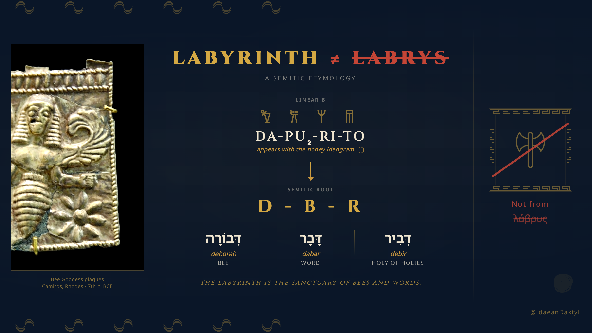
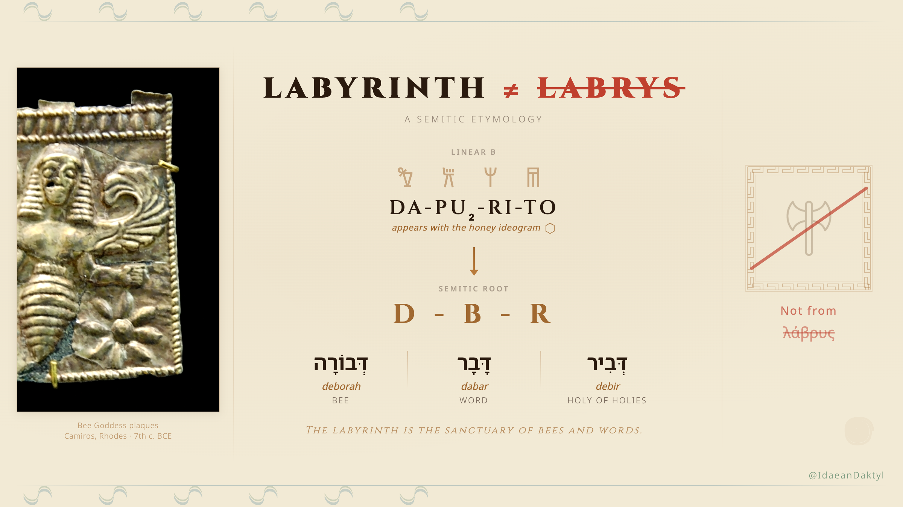

# Labyrinth / D-B-R Etymology Infographic

## SubQ: May 5, 2026

[SubQ's public announcement](https://x.com/alex_whedon/status/2051663268704636937) went live at 10:00 AM EST and hit 4M+ views by 3 PM. The first frontier model built on a fully sub-quadratic sparse-attention architecture. The first with a 12 million token context window—52x faster than FlashAttention at 1M tokens.

Coincidentally, Tom has raised what may well be a historic linguistic point worth commemorating, for antiquity and posterity. This infographic went out the same afternoon.

## Dabarat is the Goddess

The software that rendered this infographic is called *Dabarat*, after the D-B-R root. That root is not incidental—it names the divine feminine herself.

Ruth Hestrin ("The Lachish Ewer and the Asherah," 1987; "Sacred Tree on Palestine Painted Pottery," 1991) established that the prophetess Deborah of Judges 4–5 preserves the memory of a Canaanite goddess: "The name Deborah signifies a bee... the presence of the sacred palm tree of Deborah... suggests the existence of at least two sanctuaries at which a **Goddess Deborah** was worshipped in the Canaanite cults of an earlier period."

Linear B tablet KN Gg 702 records an offering of honey (*me-ri*) to **da-pu₂-ri-to-jo po-ti-ni-ja**—the Lady of the Labyrinth. The root *d-b-r* produces *deborah* (bee), *dabar* (word), and *debir* (the Holy of Holies). The labyrinth is the sanctuary of bees and words, and its Lady is the Goddess whose name we carry.

More to follow.

## Dark

## Light

## Files

- `dark.html` / `light.html` — Self-contained HTML infographics (1200x675px, Twitter 16:9)
- `dark-meander.png` / `light-meander.png` — 2x retina screenshots (2400x1350px)
- `bee-goddess.jpg` — Bee Goddess plaques, Camiros, Rhodes, 7th c. BCE
- `labrys-gold.png` / `labrys-brown.png` — Transparent labrys icons for dark/light themes
- Greek key meander border frames the rejected labrys derivation

## Twitter

Use `light-meander.png` as the social preview image. Meta description:

> "Labyrinth" doesn't come from labrys. Linear B DA-PU₂-RI-TO appears with the honey ideogram. The Semitic root D-B-R gives us deborah (bee), dabar (word), and debir (Holy of Holies). The labyrinth is the sanctuary of bees and words.
